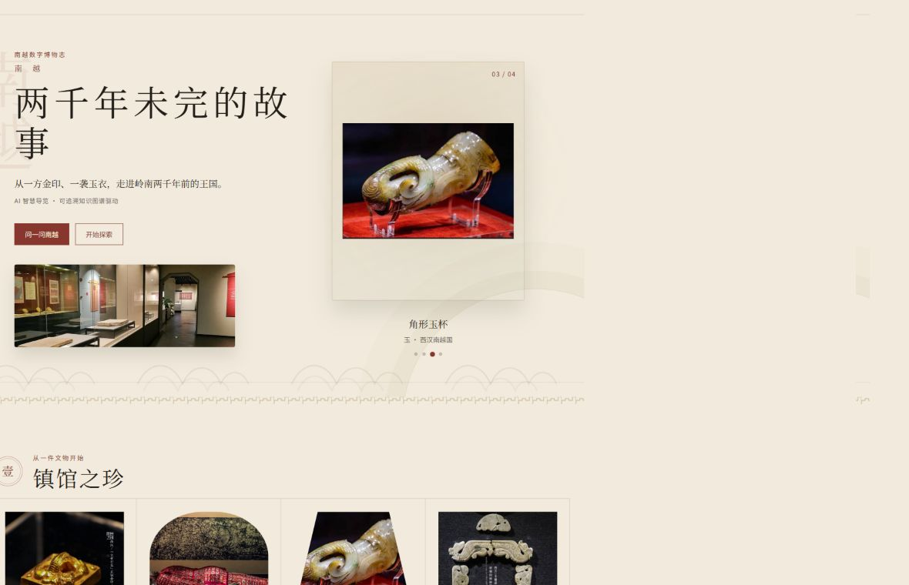
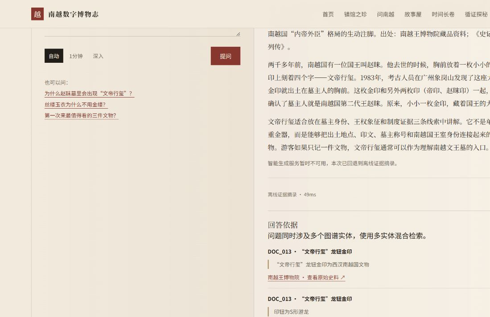
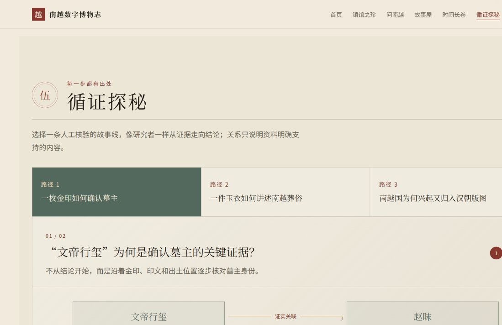
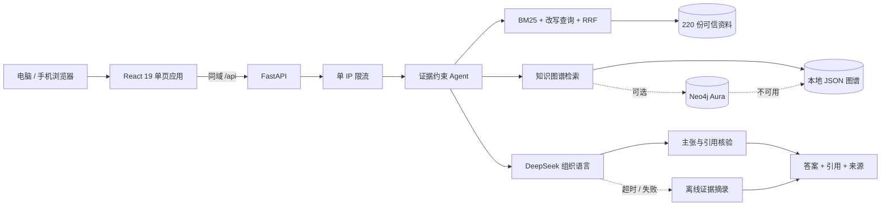

# 南越数字博物志

> 面向南越王博物院的可溯源知识图谱与 RAG 智慧导览：让游客得到好懂的回答，也让每个结论都能回到原始证据。

[](https://github.com/diongJ/AI-trip/actions/workflows/ci.yml)
[](website/)
[](app/api.py)

**[立即体验公开 Demo](https://ai-trip-production.up.railway.app/)** · 无需登录 · 支持电脑与手机访问



## 三分钟体验路线

1. 在首页浏览“镇馆之珍”，打开“文帝行玺”详情，了解文物背景与原始资料。
2. 进入“AI 问南越”，提问：**为什么赵眜墓里会出现“文帝行玺”？** 展开“可溯”查看回答依据。
3. 在“循证探秘”走完 **一枚金印如何确认墓主**，观察每一步的关系、原文证据与来源链接。
4. 切换“小越故事屋”，试问：**给我讲一个文帝行玺的小故事。**
5. 展开“研究与技术”，查看 DeepSeek、Neo4j 不可用时系统如何自动降级。

推荐问题：

- 南越是什么时期？
- 丝缕玉衣为什么不用金缕？
- 赵眜和南越文王墓是什么关系？
- 第一次来最值得看的三件文物？

## 核心体验

### 有来源的智能问答

成人问答支持自动、1 分钟和深入三种讲解长度，以及最多 4 轮上下文追问。答案展示生成模式、耗时和可展开的引用；证据不足时明确拒答，不用流畅措辞掩盖资料空缺。



### 循证叙事探索

三条人工策展路径把文物、人物、墓葬与历史事件组织成可逐步核对的证据链。每一步显示准确的中文关系、阶段结论、原文摘录、文档编号、来源机构与原始链接；因果表达只在资料明确支持时使用。



### 适合不同游客

- **成人问答**：以证据为边界的 RAG / 图谱综合回答。
- **儿童模式**：将可靠资料改写为 8–12 岁儿童易懂的故事，校验失败即回退离线版本。
- **多轮追问**：保留最近对话上下文，处理指代与延伸问题。
- **自由图谱探索**：中文关系、一跳证据、探索面包屑、返回与循环保护。
- **文物详情**：代表文物的时代、材质、出土位置、讲解与馆方来源。
- **离线降级**：外部模型或 Neo4j 不可用时，核心问答与关系查询仍可运行。

## 可信机制与数据

当前知识底座包含 **220 份分层可信资料、78 个实体、87 条证据关系**。核心馆方资料优先，扩展导览内容经过来源分层、白名单准入与逐份审核。

策展路径不是另一份前端演示数据：`data/curated/exploration_paths_v1.json` 在服务启动时会校验实体、关系、文档编号、原文证据、`factual` 角色与 `approved` 状态，任何失配都会阻止错误路径上线。

系统遵守四条规则：

- 回答与引用来自同一份检索结果；
- DeepSeek 负责组织语言，不替代事实来源；
- 智能生成未通过证据核验时，回退到本地摘录；
- 时效公告按有效日期过滤，过期参观信息不会继续参与当前问答。

## 技术架构



生产镜像采用多阶段构建：Node 22 构建 Vite，Python 3.12 安装服务并预构建 BM25 索引，最终由一个 FastAPI 进程同域提供网页和 API。生产环境暂不加载约 2GB 的 BGE 语义模型，以降低冷启动和内存压力。

## 技术栈

| 层 | 实现 |
|---|---|
| 前端 | React 19、TypeScript、Vite、响应式原生 CSS |
| API | FastAPI、Pydantic、Uvicorn |
| 检索 | 多字段 BM25 v2、查询改写、RRF 融合、片段回文档 |
| 图谱 | 78 实体 / 87 关系，本地 JSON 默认可用，Neo4j 可选 |
| Agent | 结构化规划、工具路由、证据筛选、主张核验、规则拒答 |
| 生成 | DeepSeek；失败、超时或校验不通过时离线降级 |
| 发布 | Docker、Railway、同域静态页面与 API、按 IP 限流 |

## 实测指标

| 验收集 | 规模 | 当前结果 | 用途 |
|---|---:|---:|---|
| QA 回归集 | 120 题 | **120 / 120** | 防止多跳、比较、否定、时效、儿童与拒答能力回退 |
| Agent 冒烟 | 24 题 | **24 / 24** | 核对路由、工具、引用与回答状态 |
| Demo 验证 | 5 条路径 | **5 / 5** | 核对首页数据、问答、讲解和图谱演示 |
| 离线评测 v2 | 90 题 | 回答率 **87.5%**；Hit@5 **88.75%**；引用正确率 **100%**；拒答准确率 **100%** | 独立检索与回答质量评测 |

`data/evaluation/summary_v2.json` 中约 **10.6 ms** 的 P95 是本地离线评测耗时，**不代表 DeepSeek 公网响应时间**。线上生成延迟还会受到 Railway 区域、模型排队、网络往返、规划与核验调用影响。

## 快速启动

### Docker：最接近生产环境

```bash
docker build -t nanyue-demo .
docker run --rm -p 8080:8080 -e SEMANTIC_RETRIEVAL_ENABLED=false nanyue-demo
```

打开 `http://localhost:8080`。不提供 DeepSeek Key 时会自动使用离线证据摘录；如需智能生成，仅通过运行环境设置 `DEEPSEEK_API_KEY`，不要写入镜像或仓库。

### 本地双进程：现场网络故障兜底

后端（PowerShell）：

```powershell
python -m venv .venv
.\.venv\Scripts\Activate.ps1
python -m pip install -e ".[dev]"
python -m scripts.build_rag_index --force
uvicorn app.api:app --reload --port 8000
```

前端（另一个终端）：

```powershell
Set-Location website
npm ci
$env:VITE_API_BASE_URL="http://127.0.0.1:8000"
npm run dev
```

打开 Vite 输出的本地地址。`.env` 已被 Git 忽略；真实 Key 只应存在于本机环境变量或 Railway Secrets。

## API 示例

```bash
curl http://localhost:8080/api/health
curl http://localhost:8080/api/exploration-paths
curl "http://localhost:8080/api/entities/%E8%B5%B5%E7%9C%9C/neighbors"
curl -X POST http://localhost:8080/api/ask \
  -H "Content-Type: application/json" \
  -d '{"question":"文帝行玺为什么能确认墓主？","answerMode":"auto","audience":"adult"}'
```

主要接口：

- `POST /api/ask`：问答、模式、受众与最近对话；公开环境有单 IP 限流。
- `GET /api/exploration-paths`：经过启动校验的策展证据路径。
- `GET /api/entities`、`GET /api/entities/{name}/neighbors`：实体与带引用的关系探索。
- `GET /api/stats`：语料、图谱与离线评测汇总。
- `GET /api/health`：后端能力状态与部署提交号，不暴露密钥、路径或用户问题。

## 测试

```powershell
# Python 全量单元与接口测试
.\.venv\Scripts\python.exe -m pytest

# 120 题 QA、24 题 Agent、5 条 Demo 路径
.\.venv\Scripts\python.exe -m scripts.evaluate_qa --fail-under 0.9
.\.venv\Scripts\python.exe -m scripts.verify_agent
.\.venv\Scripts\python.exe -m scripts.verify_demo

# 前端静态检查与生产构建
Set-Location website
npm run lint
npm run build
```

CI 对每次 PR 执行 Python 全量测试、120 题 QA 门禁、24 题 Agent 冒烟及前端 lint/build。

## 目录结构

```text
app/                 FastAPI、运行时与策展路径校验
data/
  raw/               分层可信原始资料
  graph/             知识图谱 V1
  curated/           实体消歧与版本化策展路径
  eval/               120 题 QA 回归集
  evaluation/        90 题离线评测 v2
src/                 RAG、图谱、Agent、DeepSeek 与配置
website/             React 前端
scripts/             构建、评测与验收脚本
docs/                设计、数据来源、部署与历史报告
```

进一步阅读：[公开 Demo 部署](docs/public_demo_deployment.md) · [Agent 设计](docs/agent_design.md) · [检索设计](docs/retrieval_design.md) · [知识图谱 Schema](docs/kg_schema.md) · [数据来源](docs/data_sources.md)

## 发布与安全

Railway 使用根目录 `Dockerfile` 与 `railway.toml`。生产环境设置 `SEMANTIC_RETRIEVAL_ENABLED=false`、`DEMO_RATE_LIMIT_PER_MINUTE=12`，并仅在 Railway Secrets 保存 `DEEPSEEK_API_KEY`。服务从平台注入的 `PORT` 启动，`/api/health` 返回发布提交号。

本项目当前为竞赛与研究 Demo。页面引用的馆方资料版权归原机构所有；公开使用时请遵守来源页面的版权与访问要求。
